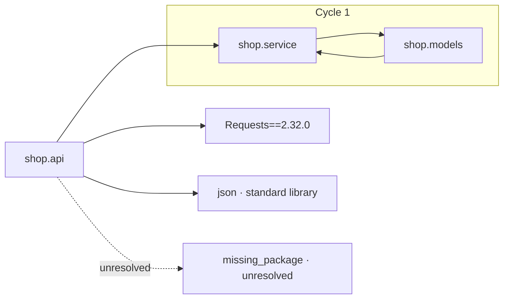

# codegraide

codegraide is an early-stage Rust CLI for understanding source repositories through code-quality metrics, dependency graphs, change hotspots, and database ERDs.

The end goal is to give developers and automated agents enough measurable evidence to identify good and bad code, explain why, and find code that needs attention.

The project is currently being developed and is in its pre-alpha stage.

## Workspace

- `crates/cli`: command-line interface, presentation, and exit behavior
- `crates/core`: analysis domain, parsers, metrics, graphs, and reports
- `crates/analyzers/python`: the first Tree-sitter language analyzer

The project is in its initial foundation stage. User-facing behavior and contribution documentation will expand as the first repository-inventory milestone is implemented.

In the future, community-developed analyzers for other languages will be welcomed. The idea is to develop an evaluation framework, and plug in additional language support packages for the framework

## Repository inventory

Inventory the current directory:

```sh
cargo run -p codegraide -- inventory .
```

The report counts inventoried files and separates them into source, documentation, configuration, data, assets, and uncategorized categories. Use `--list-files` to print the paths in one or more categories:

```sh
cargo run -p codegraide -- inventory . \
  --list-files source \
  --list-files uncategorized
```

Use `--list-files all` to print every category.

Recognized source files also report physical source, comment, and blank lines.
The current line-count implementation covers Python, Rust, C, and C++. Strings
and docstrings count as source; comment-only lines count as comments; empty lines
inside block comments count as comments.

The categories are a partition of physical lines: `total = source + comment + blank`.
Files with an unsupported language remain in inventory but are not included in
line measurements.

Machine-readable output is versioned separately from the codegraide package:

```sh
cargo run -p codegraide -- inventory . --format json
```

The JSON report includes category paths, language counts, ignored populations,
line counts, diagnostics, and `report_schema_version: "0.2.0"`. It is sorted and
does not include timestamps or absolute repository paths, so it is suitable for
fixtures and other automated consumers. Non-UTF-8 Unix path bytes are percent-
encoded and described by `inventory.path_encoding`. Warnings are included in
`diagnostics`; `--no-warnings` removes them. `--list-files` is a terminal-only
option.

Repository `.gitignore` files are respected. To include selected ignored files, repeat `--include-ignored` with repository-relative globs:

```sh
cargo run -p codegraide -- inventory . \
  --include-ignored 'generated/**' \
  --include-ignored 'vendor/**/*.py'
```

Included files are combined with normal discovery results and counted once when patterns overlap. Built-in `.git`, `target`, and `__pycache__` exclusions cannot be overridden.

Ignored file and directory counts are reported separately. Ignored directories are not walked by default, so their contents are not included in the ignored file count. Use `--audit-ignored` when exact ignored paths and counts are needed:

```sh
cargo run -p codegraide -- inventory . --audit-ignored
```

## Category rules

Default category rules ship with codegraide. Additional JSON rulesets are loaded explicitly and may be layered:

```sh
cargo run -p codegraide -- inventory . \
  --config rules/company.json \
  --config rules/repository.json
```

A ruleset can classify files by extension, exact filename, or filename regex:

```json
{
  "config_version": "0.1.0",
  "inventory": {
    "ignore_defaults": false,
    "categories": {
      "source": {
        "include_extensions": ["go"],
        "include_filename_regexes": [".*\\.generated\\.rs"],
        "exclude_filename_regexes": ["^private/.*\\.generated\\.rs"]
      }
    }
  }
}
```

The supported categories are `source`, `documentation`, `configuration`, `data`, `assets`, and `uncategorized`.

Rules extend the defaults unless a category sets `"mode": "replace"`. Setting `"ignore_defaults": true` replaces all rules loaded before that file. Regexes containing `/` match repository-relative paths; other regexes match filenames in any directory.

Invalid configuration is an error. Nonfatal warnings explain valid but potentially surprising rule interactions. Use `--no-warnings` to suppress those warnings. Errors cannot be suppressed.

## Syntax analysis

The `analyze` command runs the analyzers available for languages found in the
inventory. It scans the current directory by default, or accepts a file or
directory path:

```sh
cargo run -p codegraide -- analyze .
cargo run -p codegraide -- analyze src/service.py
```

The built-in analyzers parse Python and C++ with Tree-sitter. Python reports
modules, classes, functions, methods, decorators, parameters, syntactic
imports, explicit `__all__` exports, and function measurements. C++ reports
namespaces, classes, structs, callable definitions, lambdas, syntactic
includes, and structural measurements. A valid syntax tree is `successful`;
a tree containing parser recovery nodes is `partial`. Parse diagnostics are
evidence of syntax recovery only.
Languages that inventory recognizes but cannot analyze are still shown as
`inventory only`.

Python explicit exports use the `python-explicit-exports-v1` definition. Direct
module-level list/tuple assignments, `+=`, `append`, and `extend` operations are
evaluated without executing Python. Complete results contain the ordered names
and source spans. Dynamic, conditional, aliased, escaped, or parser-recovered
values are reported as partial or unavailable rather than guessed. A parsed
file without a recognized `__all__` declaration reports `not-declared`.

Use a full-match repository-relative regex to select files, and repeat it for
OR selection:

```sh
cargo run -p codegraide -- analyze . --match 'src/.*\\.py'
```

Ignored files can be selected with the same targeted approach as inventory:

```sh
cargo run -p codegraide -- analyze . --include-ignored 'generated/**/*.py'
```

Terminal output summarizes files with diagnostics without dumping every parser
message. Add `--diagnostics` to print all details, or pass one or more exact
selected file paths to print only those files. Use `--details` for complete
symbols, imports or includes, and measurements, optionally restricted to exact files. The JSON
will always contain every fact and diagnostic, including: analyzer versions, grammar and query
provenance, capability claims, source spans, file status, measurements, and
limitations:

```sh
cargo run -p codegraide -- analyze . --diagnostics
cargo run -p codegraide -- analyze . --diagnostics src/service.py
cargo run -p codegraide -- analyze . --details src/service.py
cargo run -p codegraide -- analyze . --format json
```

The syntax report uses the independent `syntax-analysis-v5` definition and
schema version `0.7.0`; compact review and gate JSON use `review-analysis-v3`
and schema `0.3.0`, while inventory remains on schema `0.2.0`. Syntax output
preserves Python import and C++ include evidence without labeling either as
project-resolved. The separate dependency and call commands remain
Python-only.

### C++ syntax analysis

C++ syntax analysis is statically linked through `codegraide-analyzer-cpp` and
pins `tree-sitter-cpp` 0.23.4. It analyzes `.cc`, `.cpp`, `.cxx`, `.C`, `.hh`,
`.hpp`, `.hxx`, `.ipp`, `.tpp`, and `.inl`. Ambiguous `.h` files remain
inventory-only until an explicit language or project-aware classification
mechanism is available.

The first slice emits namespaces, classes, structs, function and method
definitions, constructors, destructors, operators, template definitions, and
lambdas. It preserves lexical `::` qualification; overloads can share a name
while retaining distinct stable symbol IDs. Angle, quoted, macro, and
conditionally compiled includes retain their delimiter and conditional
context.

This is syntax evidence, not compiler semantics. It does not preprocess macros,
read `compile_commands.json`, resolve include paths, types, overloads, calls,
templates, or modules, or build a C++ dependency graph. Parser recovery makes
affected measurements unavailable. Conditional-preprocessor syntax inside a
callable also makes its complexity and nesting unavailable because no active
configuration is known. Macro-expanded control flow is therefore a syntactic
lower bound.

### Python documentation coverage

`analyze` reports `python-documentation-coverage-v1` by default. It recognizes
nonblank conventional Python docstrings on modules, top-level classes and
functions, and methods declared directly on top-level classes. Nested
definitions, definitions nested under conditional/control-flow statements, and
lambdas are excluded from the denominator. Repeated `@overload` declarations
and their implementation count as one logical function. Private, dunder,
async, static, class, and property methods remain eligible.

Conventional Python test paths are skipped by default for this metric: a
`test/` or `tests/` path component, `test_*.py`, `*_test.py`, or `conftest.py`.
This does not stop `analyze` from parsing or reporting those files. Add
`--include-tests` to either `analyze` or `comments` when test documentation is
part of the intended contract. Use `--no-documentation-coverage` when this
evidence is not needed at all.

The focused command reports the same evidence without the rest of the syntax
detail:

```sh
cargo run -p codegraide -- comments .
cargo run -p codegraide -- comments . --include-tests
cargo run -p codegraide -- comments . --format json
cargo run -p codegraide -- comments . --documentation-review-below 80 --gate
```

Coverage is `documented / (documented + missing)`. Unavailable symbols are
reported separately and prevent a configured threshold from passing. JSON
retains exact counts and integer basis points; threshold comparison uses the
exact fraction rather than the displayed percentage. The standalone report
schema starts at `0.1.0`. Codegraide does not emit docstring text.

Detection follows Python's first-statement docstring convention. Leading
comments are ignored; bytes and formatted strings do not count. Empty or
whitespace-only lexical content is missing. Escape sequences are not decoded,
which is an explicit limitation of this static v1 analysis.

## Python dependency graphs

Build a project-level Python dependency graph with local module resolution:

```sh
cargo run -p codegraide -- dependencies .
```

Codegraide discovers import roots from supported `pyproject.toml` Setuptools or
Poetry layout fields, then falls back to `src/` or a flat project layout. Local
modules resolve without starting Python. Select an interpreter or virtual
environment explicitly to classify standard-library imports and packages
installed in that environment:

```sh
cargo run -p codegraide -- dependencies . --python /path/to/python
cargo run -p codegraide -- dependencies . --venv .venv
```

Codegraide does not infer an activated environment, install anything, access a
package index, or import the packages being inspected. Starting the selected
interpreter is a trusted operation; its ordinary site initialization still
applies. Python 3.8 or newer is required for environment enrichment.

The default terminal report shows resolution coverage, global node and relation
counts, fan-in and fan-out rankings, strongly connected cycle groups, and
unresolved or ambiguous investigation nodes.

For a graph you can explore, generate a self-contained HTML file. It works
offline and does not require Mermaid, Graphviz, Node, or a web server:

```sh
cargo run -p codegraide -- dependencies . \
  --local-only --format html --output dependencies.html --open
```

The overview starts at package level and automatically enters a project with a
single root package. Select a package to drill into its immediate modules and
child packages, then use the breadcrumbs to move back up. Package edges retain
all underlying import evidence. Searching for a module opens its package
ancestors automatically. The overview also collapses each dependency cycle at
the current level so cyclic packages do not dominate the diagram. Switch to
Neighborhood to isolate a selected module's immediate context, or use Full
graph to expand every module. The details panel shows full module names,
repository-relative paths, imports, dependents, and source evidence without
putting fan-in or fan-out counts into node labels.

`--open` uses the operating system's default browser. To open the generated
file specifically in Google Chrome on macOS:

```sh
open -a "Google Chrome" dependencies.html
```

Static visual and machine-readable formats are emitted directly to stdout:

```sh
cargo run -p codegraide -- dependencies . --format mermaid > dependencies.mmd
cargo run -p codegraide -- dependencies . --format dot > dependencies.dot
cargo run -p codegraide -- dependencies . --format json > dependencies.json
dot -Tsvg dependencies.dot > dependencies.svg
```

The dependency JSON API has its own `0.4.0` report schema. It includes graph and
metric definition versions, environment provenance without machine-local
paths, global resolution coverage, applied view filters, typed nodes, evidence-
backed relations, SCCs, and an optional query result.

Cycle output keeps SCCs as the cycle-group definition and adds a compact,
evidence-backed explanation: one deterministic shortest witness loop plus an
approximate set of relations to reconsider. The recommendation weights each
relation by its source import-site count and verifies that removing the whole
set makes the component acyclic. It is a navigation aid, not a claim that the
suggested changes are optimal or architecturally correct. Terminal and HTML
details show the supporting file, line, and column for every suggested cut.

Use focused views to keep large diagrams readable. Filters select presentation
nodes and relations; they never recalculate the global fan metrics or cycles:

```sh
# One module and its direct dependencies and dependents
cargo run -p codegraide -- dependencies . \
  --focus shop.service --depth 1 --direction both --format mermaid

# Exact repository-local relationships only
cargo run -p codegraide -- dependencies . --local-only --exact-only --format dot

# Only cyclic local SCCs
cargo run -p codegraide -- dependencies . --cycles-only --format mermaid
```

Ask exact-local reachability questions without treating uncertain imports or
external package boundaries as traversable edges:

```sh
# Deterministic shortest path; a missing path is a successful `found: false`
cargo run -p codegraide -- dependencies . \
  --path-from shop.api --path-to shop.models --format html \
  --output dependency-path.html --open

# All transitive local dependencies (the default closure direction)
cargo run -p codegraide -- dependencies . --closure shop.api

# Every local module that transitively depends on shop.models
cargo run -p codegraide -- dependencies . \
  --closure shop.models --direction dependents --format mermaid
```

Path queries use sorted-neighbor breadth-first search, so equally short paths
have deterministic tie-breaking. Closure output is sorted. Query views retain
the same stable full-graph node IDs used by ordinary filtered views.

Every Python import records independent context dimensions: module/class/
callable scope, runtime/type-checking-only usage, required/optional requirement,
and conditional execution. All imports remain included by default. Exclude
selected contexts before graph construction when you want to ask how those
imports affect coupling, paths, or cycles:

```sh
cargo run -p codegraide -- dependencies . --exclude-type-only
cargo run -p codegraide -- dependencies . --exclude-optional --format html \
  --output runtime-required-dependencies.html --open
cargo run -p codegraide -- dependencies . \
  --exclude-callable-local --exclude-conditional --format json
```

These are analysis-input exclusions, not visual filters: coverage, relations,
fan-in/out, SCCs, cycle explanations, and path/closure queries are recalculated.
JSON records the applied exclusions, and terminal/HTML evidence shows context
badges. Import context classification is
versioned as `python-import-context-v1`.

A representative graph looks like this:



Exact relations alone contribute to fan-in and fan-out. SCCs and cycles use
exact local-module relations only. Dynamic imports, custom import hooks,
runtime re-exports, and the internals of external packages remain outside the
static graph contract.

## Python call graphs

Build an evidence-backed symbol call graph with a separate command and report:

```sh
cargo run -p codegraide -- calls .
cargo run -p codegraide -- calls . --local-only --format html \
  --output calls.html --open
cargo run -p codegraide -- calls . --local-only --format html \
  --include-source --output calls-with-source.html --open
cargo run -p codegraide -- calls . \
  --focus shop.service::Client.send --direction both --depth 1 \
  --format mermaid
cargo run -p codegraide -- calls . --cycles-only --format dot > calls.dot
```

Call extraction is `python-call-references-v1`; syntax JSON is `0.7.0`, and the
independent call-report JSON schema starts at `0.1.0` with `call-graph-v1`.
Selectors use `module::qualified.symbol`, such as
`shop.service::Client.send`; duplicate definitions require `#N`.

Version 1 resolves same-module and nested functions, imported function aliases,
local module aliases, `self.method()`/`cls.method()` in the same class, local
constructors, and direct recursion. It preserves external, ambiguous, and
unresolved call boundaries. Arbitrary instance dispatch, assignment aliases,
inheritance lookup, decorators, monkey patching, higher-order values, and
runtime metaprogramming are deliberately not guessed. The HTML output reuses
the offline explorer, including hierarchy drill-down, search, neighborhood
views, evidence inspection, recursion groups, pan, and zoom.

Add `--include-source` to HTML output to embed source for local symbols.
Selecting a symbol then shows its definition and every direct caller grouped
with the supporting call sites. Definitions up to 15 lines expand
automatically; longer definitions and caller bodies can be expanded in the
sidebar. Hovering a caller card highlights the corresponding graph
relationship. Source embedding is opt-in because it increases report size and
can expose private repository code when an HTML report is shared. It changes
only the HTML presentation payload, not the stable call-report JSON schema.

## Deterministic review gate

Syntax analysis also produces a review evaluation for the selected snapshot, meant as a source of
evidence for an agent or reviewer, not a code-quality "score".
The default policy reports human review when an analyzed Python or C++
callable's cyclomatic complexity is 11 or higher. Rankings and findings identify
the language-specific metric ID and definition version used. Documentation coverage is informational unless an
explicit `documentation_coverage.human_review_below` policy or
`--documentation-review-below` CLI threshold is supplied. Default risk bands are defined as: low (1-5), moderate (6-10), high
(11-20), and critical (21+). A finding uses `risk` for the measured band and
`required_action` for the policy result: `none`, `human-review`, or `block`.
The overall status is `pass`, `human-review-required`, or `blocked`.

The goal of this functionality is to allow an agent to deterministically evaluate and identify
areas of code that, according to some defined metrics and corresponding threshold for said metric,
require certain actions, such as in-depth agent review, further codegraide analysis (via future tooling),
human/SME review, etc.

Ordinary `analyze` is purely informational and should always exit successfully after completion. 
Add `--gate` when an automation needs policy exit codes:
0 means pass, 2 means human review is required, and 3 means the configured
policy blocks the inputted source from "passing". 
Operational, input, policy, and serialization errors use exit
code 1.

```sh
cargo run -p codegraide -- analyze . --format json --gate
cargo run -p codegraide -- analyze . --gate --complexity-block-at 21
cargo run -p codegraide -- analyze . --policy review-policy.json --gate

# Compact agent review report: policy, coverage, findings, and top rankings
cargo run -p codegraide -- analyze . --format json --profile review --top 20 --gate

# Minimal CI/orchestration report
cargo run -p codegraide -- analyze . --format gate --top 10 --gate
```

`--format json` spits out the full analysis report by default, including symbols,
decision events, dependencies, and diagnostics. Use `--profile review` to
return only the review-oriented projection. The separate `gate` format is
even more compact; it reports: status, the process-equivalent exit code, total
finding count, and a bounded list of top findings, controlled by `--top`.
Reviews default to 20 and `gate` defaults to 10 when the optional parameter is omitted.

An optional policy file can be selected explicitly, allowing consumers to configure thresholds,
risk bands, and document exceptions. CLI threshold options are also available, it should be noted
that they will always override matching policy-file values when conflicts are present. 
A bounded exception provides a "pass" for a named symbol up to
a number, `approved_max`; `unbounded: true` prevents the action from providing an exception at all,
while still calculating the ranking and evidence. Every exception requires a reason for documentation purposes.

```json
{
  "policy_version": "0.2.0",
  "cyclomatic_complexity": {
    "human_review_at": 11,
    "block_at": 21,
    "risk_bands": {"moderate_at": 6, "high_at": 11, "critical_at": 21},
    "exceptions": [
      {
        "symbol_id": "src/legacy.py::function:legacy#1",
        "reason": "Reviewed parser generated from an external protocol",
        "approved_max": 24
      }
    ]
  },
  "documentation_coverage": {
    "human_review_below": 80
  }
}
```

Policy format `0.1.0` remains accepted for existing complexity-only files.

### How Python complexity is calculated

For each Python function-like callable, Codegraide starts with a score of `1`.
It adds one point for every decision point inside that callable. In v1, those
decision points are:

- `if` and `elif`
- `for` and `while` loops
- exception handlers such as `except ValueError`
- refutable `match` cases and match guards
- short-circuit boolean expressions such as `a and b`
- conditional expressions such as `x if condition else y`
- each loop or filter in a comprehension
- `assert` statements

The following do not add points: `else`, `with`, the `try` statement itself,
`finally`, or an unconditional `match` case. Named functions, methods, nested
functions, and lambdas are scored separately. Module and class bodies are not
scored in v1.

The JSON report includes the source location of every counted decision. This
lets a user inspect the evidence behind the score themselves, instead of
treating it as a final verdict about code quality. This is particularly useful
for adjusting custom exception boundaries or disabling exceptions for frequently-flagged
areas of code deemed "satisfactory" to the user.

### How C++ complexity is calculated

For each C++ function, method, or lambda, Codegraide starts at `1` and adds one
for each `if` or `else if`, loop (including range-for and do-while), non-default
`case`, `catch`, `&&`, `||`, or conditional expression. It does not add points
for `else`, `default`, `switch` itself, `try`, `throw`, `goto`, `break`,
`continue`, or coroutine operators. The metric is
`cpp-cyclomatic-complexity-v1`.

`cpp-max-control-flow-nesting-v1` counts nested `if`, loop, `switch`, `try`,
and catch bodies. An `else if` remains at its chain depth, catch bodies remain
at their associated try depth, case labels add no depth, and lambdas start a
new callable scope.
